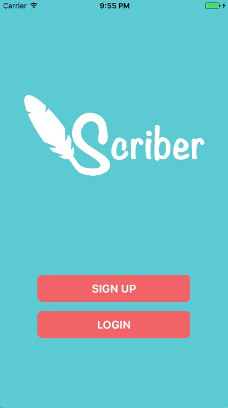
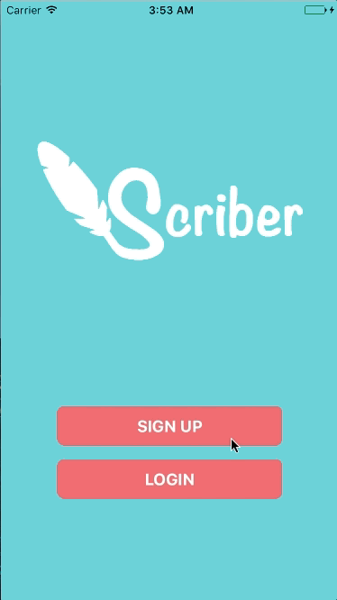
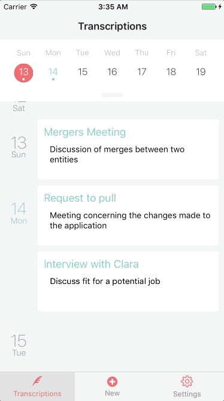
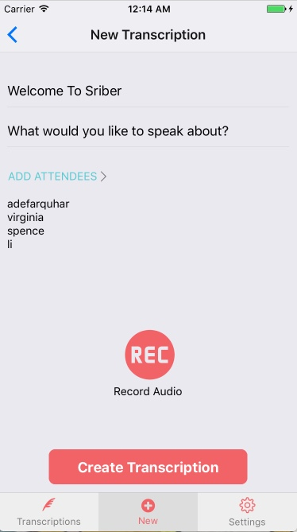
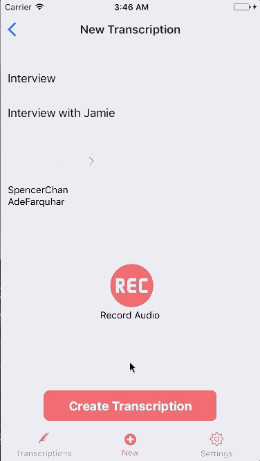
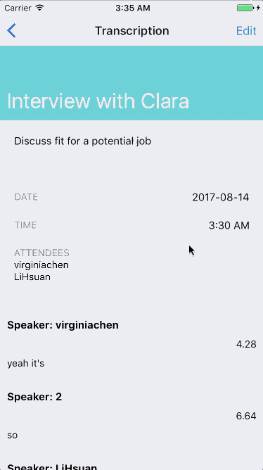

# Scriber

Keeping tracks of meeting notes is often a meticulous task. There is the option of recording the meeting and then paying for transcribing services. Scriber provides the ability to create meeting (of various types) transcriptions, audio playback of specific segments and viewing transcription text, with minimal expense.

[Scriber][scriber_page]'s contributing members include [Virginia Chen][virginia_git], [Spencer Chan][spencer_git], [Li Hsuan Lu][lihsuan_git] and [Ade Farquhar][ade_git].

[scriber_page]:http://wwww.scriber.us
[virginia_git]:https://github.com/virginiac32
[spencer_git]:https://github.com/schan1031
[lihsuan_git]:https://github.com/travelingpiano
[ade_git]:https://github.com/ade713





## Features

+ Secure user account creation with asychronous storage.
+ Create transcriptions with attendees/speakers.
+ Speech to text using IBM Watson API.
+ Transcription storage with PostgreSQL.
+ Audio file storage via AWS S3.
+ Segment audio playback.

## Implementation

Authentication is handled with **AsyncStorage** which is an asychronous, persistent, key-value storage system. It works with fetch requests and Django's authentication which secures user data. AsyncStorage also permits persistence the user's session token after the app has closed.

```js
async loadInitialState() {
  try {
    let token = await AsyncStorage.getItem('token');
    let username = await AsyncStorage.getItem('username');

    if (token !== null ) {
      this.setState({
        token: token, error: null, username: username
      });
      this.getData(this.state.token);
    } else {
      this.setState({
        'error': 'Login Error'
      })
    }
  } catch (error) {

  }
}
```





All transcriptions are organized and displayed by the date created with a React Native's calendar library. Displays are rendered using components such as **Text**, **View**, and **TouchableWithoutFeedback**.

```js
<TouchableWithoutFeedback
  transcriptionPk={ item.transcription.pk }
  onPress={ () => this.onRowPress(item.transcription.pk) } >
  <View
    style={ [styles.item, { height: item.height }] } >
    <Text>{ item.name }</Text>
  </View>
</TouchableWithoutFeedback>
```

When a transcription is being made, users can add or remove participants, add a title and description and record the meeting.




Once recording is finished and the user presses the button to create the transcription, data is sent to the back-end for handling by the Django actions in the views file.

```py
def create(self, request):
      # print(request.data.get('audio_url'))
      user_array = []
      if isinstance(request.data.get('usernames'),str):
          user_array = request.data.get('usernames')[1:-1].split(',')
      else:
          user_array = request.data.get('usernames')
      users = User.objects.filter(username__in=user_array)
      transcription_result = {}
      transcription_result['audio_url'] = request.data.get('audio_url')
      transcription_result['title'] = request.data.get('title')
      transcription_result['transcription'] = transcribe(request.data.get('audio_url'),request.data.get('title'))
      transcription_result['created_time'] = timezone.now().time()
      transcription_result['created_date'] = timezone.now().date()
      transcription_result['usernames'] = user_array
      transcription_result['description'] = request.data.get('description')
      serializer = TranscriptionSerializer(data=transcription_result)
      if serializer.is_valid():
          serializer.save()
          transcription = Transcription.objects.get(pk=serializer.data['pk'])
          transcription.users.add(*users)
          return Response(serializer.data, status=status.HTTP_201_CREATED)
```
The create method within the **TranscriptionViewSet** processes the data received and saves it to the PostgreSQL database. After saving the transcription, it's added to the index of transcriptions. Serializers are determine what information is returned to the user with model and fields.

```py
class TranscriptionIndexSerializer(serializers.ModelSerializer):
    class Meta:
        model = Transcription
        fields = ('audio_url','title','created_time','created_date','description','usernames','pk')
```

Users can also edit transcriptions as needed, adding or removing attendees, properly identifying speakers, the meeting's title, and description.




## Technology
Scriber was developed with a combination of the following frameworks and technologies:

**React Native**

React Native is a mobile app front-end framework driven by JavaScript.
The user interface is displayed with the components mentioned previously. The app design follows the Redux implementation for better data flow. In addition to providing a great user interface, it enables many of the app features including recording transcriptions, adding users to transcriptions, and tracking transcriptions via a calendar.

**Django**

Fast and secure framework powered by Python. Django also provides the opportunity for Scriber to scale quickly with flexibility. Django's server manages back-end authentication and front-end interaction with Fetch request and REST routes. Audio file conversion (aac to mp3), and file uploads to storage are a couple of the tasks handled on the back-end.

**PostgreSQL**

Advanced database which creates a smooth interaction with the Django back-end.

**IBM Watson**

With the power of the Watson API, Scriber also analyzes audio files, and identifies speakers.

**Amazon Web Services (AWS)**

AWS S3 securely stores the audio files created on the front-end.

## Future Development Plans

### Metadata analysis


### Comments

Allows users to comment on segments of transcriptions.
